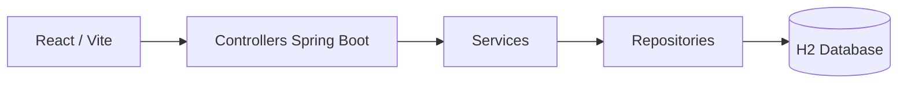

# Sistema de Aluguel de Carros

> [!NOTE]
> Sistema web para gerenciamento de aluguel de carros, com autenticacao, cadastro de clientes, gestao de automoveis, pedidos de aluguel e contratos de credito. O projeto utiliza Spring Boot no back-end e React no front-end, com foco em organizacao MVC, persistencia local e fluxo completo entre interface, API e banco.


---

## Indice

- [Links uteis](#links-uteis)
- [Sobre o projeto](#sobre-o-projeto)
- [Funcionalidades principais](#funcionalidades-principais)
- [Tecnologias utilizadas](#tecnologias-utilizadas)
- [Arquitetura](#arquitetura)
- [Instalacao e execucao](#instalacao-e-execucao)
- [Estrutura de pastas](#estrutura-de-pastas)
- [Demonstracao](#demonstracao)
- [Testes](#testes)
- [Documentacoes utilizadas](#documentacoes-utilizadas)
- [Autores](#autores)
- [Agradecimentos](#agradecimentos)

---

## Links uteis

- Aplicacao front-end local: [http://localhost:5173](http://localhost:5173)
- API Spring Boot local: [http://localhost:8080](http://localhost:8080)
- Console do H2: [http://localhost:8080/h2-console](http://localhost:8080/h2-console)
- Diagramas do projeto: [docs/diagramas](./docs/diagramas)
- Historias de usuario: [docs/historias/HistoriasDeUsuario.md](./docs/historias/HistoriasDeUsuario.md)

---

## Sobre o projeto

Este projeto foi desenvolvido para representar um sistema de aluguel de carros com diferentes perfis de usuario e fluxo web completo entre front-end, back-end e banco de dados. A aplicacao permite autenticar usuarios, cadastrar e gerenciar clientes, consultar automoveis, criar pedidos de aluguel e acompanhar contratos de credito.

No contexto academico, o sistema tambem serve para demonstrar a aplicacao de MVC, separacao por camadas (`controller`, `service`, `repository`, `model`), consumo de API REST com React e persistencia com Spring Data JPA.

O repositorio atual contem o sistema mais amplo, mas a entrega relacionada ao CRUD de cliente continua representada no modulo de clientes, com criacao, listagem, edicao e exclusao integradas ao restante da aplicacao.

---

## Funcionalidades principais

- Login unificado para cliente e agente.
- Cadastro e CRUD completo de clientes.
- Listagem e gestao de automoveis.
- Criacao e edicao de pedidos de aluguel.
- Gerenciamento de contratos de credito e contratos de aluguel.
- Perfis separados para cliente, agente empresa e agente banco.
- Persistencia em banco H2 com carga inicial de dados para testes locais.

---

## Tecnologias utilizadas

### Front-end

- React 18
- JavaScript
- Vite 5
- CSS

### Back-end

- Java 17
- Spring Boot 3.3.5
- Spring Web
- Spring Data JPA
- H2 Database

### Ferramentas de desenvolvimento

- Maven
- Git e GitHub
- Postman para testes de API

---

## Arquitetura

O projeto segue uma organizacao em camadas inspirada no padrao MVC:

- `controller`: recebe requisicoes HTTP e devolve respostas JSON.
- `service`: concentra regras de negocio e validacoes.
- `repository`: acessa o banco usando Spring Data JPA.
- `model`: representa entidades e objetos do dominio.
- `frontend`: consome a API REST e organiza as telas em React.

### Fluxo principal



### Modulos principais do back-end

- `AuthController`: autenticacao de clientes e agentes.
- `ClienteController`: CRUD de clientes.
- `AutomovelController`: gestao da frota.
- `PedidoAluguelController`: fluxo de pedidos.
- `ContratoController`: contratos de aluguel e credito.
- `AgenteController`: cadastro e manutencao de agentes.

### Diagramas disponiveis no repositorio

- `docs/diagramas/DiagramaDeCasosDeUso..png`
- `docs/diagramas/DiagramaDeClasses.png`
- `docs/diagramas/DiagramaDeComponentesALT.png`
- `docs/diagramas/DiagramaDeImplantacaoALT.png`
- `docs/diagramas/DiagramaDePacotesALT.png`

---

## Instalacao e execucao

### Pre-requisitos

- Java JDK 17 ou superior
- Maven instalado no sistema
- Node.js 18 ou superior
- npm

### Variaveis e configuracao

O projeto nao depende de `.env` para rodar localmente. A configuracao principal do back-end esta em:

- [backend/src/main/resources/application.properties](./backend/src/main/resources/application.properties)

Configuracoes padrao:

- porta do back-end: `8080`
- banco: `H2` em arquivo local
- console H2 habilitado em `/h2-console`

### Como executar o back-end

```powershell
cd C:\Users\gv\Documents\GitHub\PROJETOSBONS\sistema-aluguel-carros\backend
mvn spring-boot:run
```

### Como executar o front-end

```powershell
cd C:\Users\gv\Documents\GitHub\PROJETOSBONS\sistema-aluguel-carros\frontend
npm install
npm run dev
```

### Build do projeto

Back-end:

```powershell
cd C:\Users\gv\Documents\GitHub\PROJETOSBONS\sistema-aluguel-carros\backend
mvn clean package
```

Front-end:

```powershell
cd C:\Users\gv\Documents\GitHub\PROJETOSBONS\sistema-aluguel-carros\frontend
npm run build
```

### Dados iniciais para teste

O projeto possui carga automatica de dados em [backend/src/main/java/br/com/aluguelcarros/DataInitializer.java](./backend/src/main/java/br/com/aluguelcarros/DataInitializer.java).

Credenciais iniciais:

- Cliente
  - login: `carlos.mendes@email.com`
  - senha: `Senha123`
- Agente empresa
  - login: `agente@locadora.com`
  - senha: `Agente123`

### Endpoints principais

- `POST /auth/login`
- `GET /clientes`
- `POST /clientes`
- `PUT /clientes/{id}`
- `DELETE /clientes/{id}`
- `GET /automoveis`
- `GET /pedidos`
- `GET /contratos/aluguel`
- `GET /contratos/credito`

---

## Estrutura de pastas

```text
.
|-- backend/
|   |-- pom.xml
|   `-- src/
|       |-- main/
|       |   |-- java/br/com/aluguelcarros/
|       |   |   |-- controller/
|       |   |   |-- model/
|       |   |   |-- repository/
|       |   |   |-- service/
|       |   |   |-- DataInitializer.java
|       |   |   `-- SistemaAluguelCarrosApplication.java
|       |   `-- resources/
|       |       `-- application.properties
|       `-- test/
|           `-- java/br/com/aluguelcarros/controller/
|               `-- ClienteControllerIntegrationTest.java
|-- frontend/
|   |-- package.json
|   `-- src/
|       |-- components/
|       |-- pages/
|       |-- services/
|       |-- utils/
|       |-- App.jsx
|       |-- main.jsx
|       `-- styles.css
|-- docs/
|   |-- diagramas/
|   `-- historias/
`-- README.md
```

---

## Demonstracao

As evidencias visuais e diagramas do projeto estao organizados na pasta [docs/diagramas](./docs/diagramas).

Algumas telas e fluxos implementados no front-end:

- autenticacao de usuario
- listagem de clientes
- formulario de criacao e edicao de cliente
- listagem de automoveis
- pedidos de aluguel
- contratos de credito
- perfis de cliente e agente

---

## Testes

### Teste automatizado do back-end

Existe um teste de integracao do CRUD de clientes em:

- [backend/src/test/java/br/com/aluguelcarros/controller/ClienteControllerIntegrationTest.java](./backend/src/test/java/br/com/aluguelcarros/controller/ClienteControllerIntegrationTest.java)

Para rodar:

```powershell
cd C:\Users\gv\Documents\GitHub\PROJETOSBONS\sistema-aluguel-carros\backend
mvn test
```

### Validacao do front-end

```powershell
cd C:\Users\gv\Documents\GitHub\PROJETOSBONS\sistema-aluguel-carros\frontend
npm run build
```

### Testes manuais recomendados

- login de cliente e de agente
- criacao de cliente
- listagem de clientes
- atualizacao de cliente
- exclusao de cliente
- consulta de automoveis
- criacao e edicao de pedido

---

## Documentacoes utilizadas

- React: [https://react.dev/](https://react.dev/)
- Vite: [https://vitejs.dev/](https://vitejs.dev/)
- Spring Boot: [https://docs.spring.io/spring-boot/docs/current/reference/html/](https://docs.spring.io/spring-boot/docs/current/reference/html/)
- Spring Data JPA: [https://spring.io/projects/spring-data-jpa](https://spring.io/projects/spring-data-jpa)
- H2 Database: [https://www.h2database.com/html/main.html](https://www.h2database.com/html/main.html)
- Maven: [https://maven.apache.org/](https://maven.apache.org/)

---

## Autores

| Nome | GitHub |
|------|--------|
| Arthur | [@arthurgvv](https://github.com/arthurgvv) |

> Se o trabalho for em grupo, voce pode completar esta tabela com os demais integrantes antes da entrega final.

---

## Agradecimentos

- Professor e disciplina, pelo direcionamento academico do projeto.
- Equipe do trabalho, pela divisao das entregas e validacao dos requisitos.
- Documentacoes oficiais de Spring Boot, React, Vite e H2, que apoiaram a implementacao.

